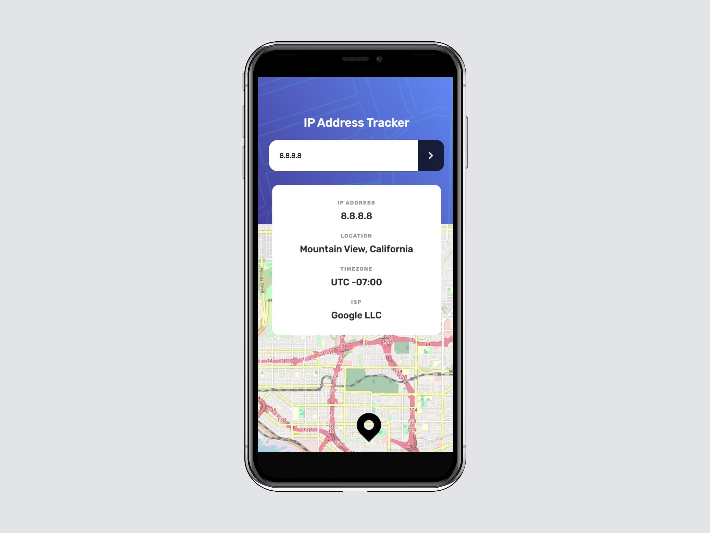

# Frontend Mentor - IP address tracker solution

This is a solution to the
[IP address tracker challenge on Frontend Mentor](https://www.frontendmentor.io/challenges/ip-address-tracker-I8-0yYAH0).
Frontend Mentor challenges help you improve your coding skills by building
realistic projects.

## Table of contents

- [Overview](#overview)
  - [The challenge](#the-challenge)
  - [Screenshot](#screenshot)
  - [Links](#links)
- [My process](#my-process)
  - [Built with](#built-with)
  - [What I learned](#what-i-learned)
  - [Useful resources](#useful-resources)
- [Author](#author)
- [Acknowledgments](#acknowledgments)

## Overview

### The challenge

Users should be able to:

- View the optimal layout for each page depending on their device's screen size
- See hover states for all interactive elements on the page
- See their own IP address on the map on the initial page load
- Search for any IP addresses or domains and see the key information and
  location

### Screenshot

### Links

- Solution URL: [GitHub](https://github.com/svetikbaihe/ip-address-tracker.git)
- Live Site URL: [Vercel](https://ip-address-tracker-wheat-psi.vercel.app/)

## My process

### Built with

- HTML markup
- Typescript
- SCSS/SASS
- Flexbox
- Tailwind
- Mobile-first workflow
- Prettier
- Leaflet
- ipify
- Vite(yarn)

### What I learned

Through this project, I have learned how to work with maps. Additionally, I am
continuing to learn how to work with APIs and how to build responsive designs.

### Useful resources

- [W3Schools](https://www.w3schools.com/) - Web building tutorials with various
  examples.
- [MDN](https://mockupbro.com/) - It's a great resource to learn HTML, CSS and
  JS and etc.
- [MockupBro](https://mockupbro.com/) - This is a great online mockup generator.
- [PIXLR](https://pixlr.com/) - Perfect free online photo editor for easy and
  quick collages.

## Author

- Frontend Mentor -
  [@svetikbaihe](https://www.frontendmentor.io/profile/svetikbaihe)

## Acknowledgments

- Kudos to my mentor - [@ArtemPapusha](https://github.com/ArtemPapusha)
